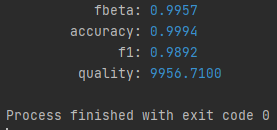

# Домашняя работа №2 (задание 3)

Выполнили студенты ИУ8-83 МГТУ им Н.Э.Баумана:
+ Антипов Илья
+ Кильдишев Евгений
+ Тихомиров Никита

Задание организовано в согласии с данными конкурса от Positive Technologies (подробнее: <https://gist.github.com/NickTikhomirov/c6254b6c979f566ec6c058643ce2ed35>)

**Достигнутый результат: около 9956.7 при f1 = 98.9%**

